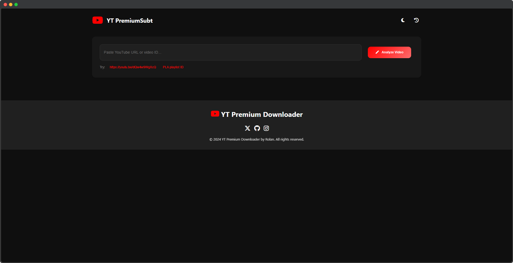
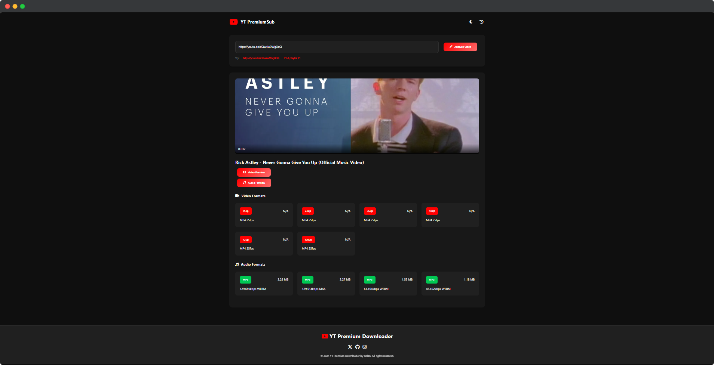
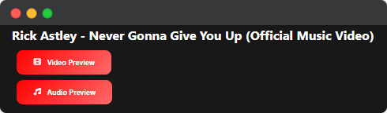
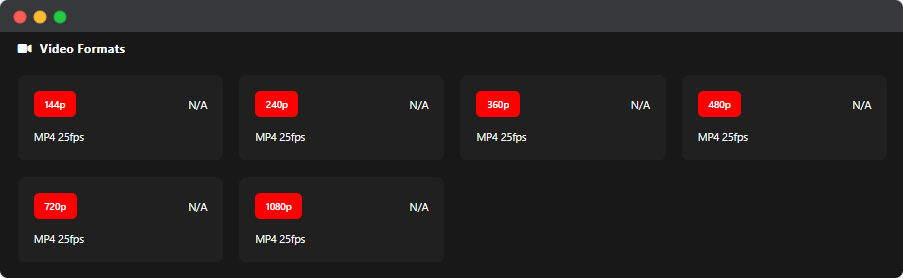
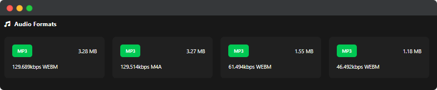
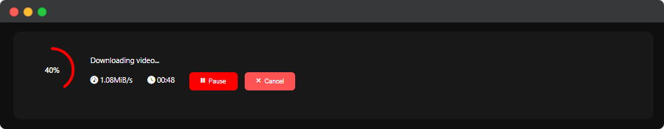
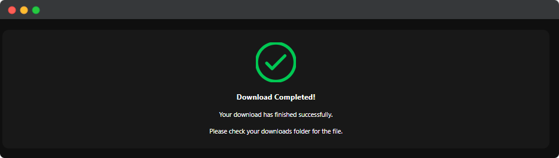
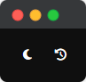
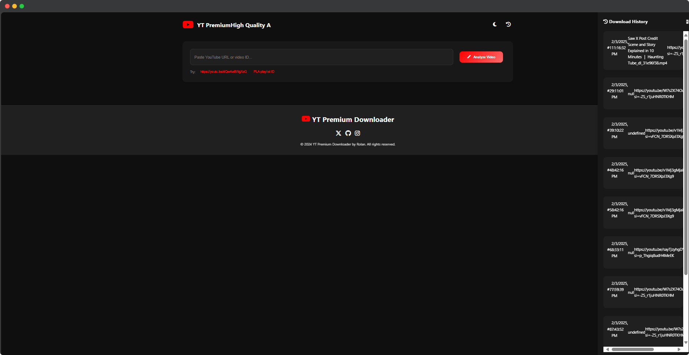
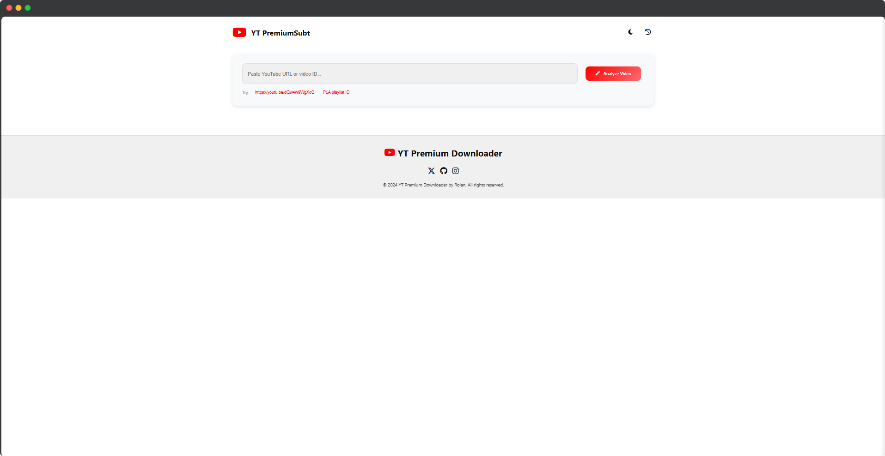

# 🎥 YouTube Premium Downloader

A modern YouTube video and audio downloader web application with dark/light themes, preview functionality, and download management.

 

## ✨ Features

- 🌓 Dark/Light theme toggle
- 🎬 Video/Audio preview generation
- 📊 Download progress tracking
- ⏯️ Pause/Resume downloads
- 📥 Download history management
- 🎨 Modern responsive UI
- 📱 Mobile-friendly design
- 🔒 Safe download management
- 🎞️ Thumbnail previews
- 📈 Real-time stats

### After pasting the YouTube URL and clicking the "Analyze Video" button, the system will process the video details.

### The preview feature allows you to watch a preview of the video before downloading.

### Various video formats are available for selection, allowing you to choose the one that best suits your needs.

### Different audio formats are available, allowing you to select the one that best fits your preferences.

### Once the download starts, you can monitor the progress bar, real-time network speed, and estimated download time. Additionally, you can pause or resume the download using the pause/resume button or cancel it with the cancel button.

### After the download is complete, a message will appear confirming that the download has finished successfully.

### This interface features a dark mode and includes a "Download History" button, allowing you to view your recently downloaded videos.

### Download History

### The website also offers a light mode for a brighter and visually comfortable experience.

## 🚀 Installation

### Prerequisites
- Python 3.8+
- FFmpeg (installation instructions below)
- Node.js (for optional frontend build)

## Steps
1. Clone the repository:

       git clone https://github.com/yourusername/youtube-premium-downloader.git
       cd youtube-premium-downloader

## Install Python dependencies:

    pip install -r requirements.txt

## Install FFmpeg:

### For Ubuntu/Debian
    sudo apt install ffmpeg

### For Windows (using chocolatey)
    choco install ffmpeg

### For MacOS
    brew install ffmpeg

### Create required directories:

    mkdir -p previews static/images

### Start the application:

    python app.py

### Visit http://localhost:5000 in your browser to use the application!

## 🛠️ Configuration
Environment variables (optional):

    DOWNLOAD_DIR=/path/to/downloads
    PREVIEW_DIR=/path/to/previews
    CUSTOM_FFMPEG_PATH=/path/to/ffmpeg

## 📚 Usage
- Paste a YouTube URL in the input field

- Click "Analyze Video"

- Choose video/audio quality

- Start download

- Manage downloads through the history panel

## 🧰 Tech Stack
Backend:

- Python 3

- Flask

- yt-dlp

- FFmpeg

Frontend:

- Modern JavaScript (ES6+)

- CSS3 with CSS Variables

- Font Awesome icons

- Responsive design

## ❓ FAQ
Q: Why am I getting "FFmpeg not found" errors?
A: Ensure FFmpeg is installed and in your system PATH. See installation instructions.

Q: Where are downloaded files saved?
A: Files are saved to your system's Downloads folder by default.

Q: Can I download age-restricted content?
A: The application follows YouTube's terms of service. Some content may not be downloadable.

## 🤝 Contributing
Contributions are welcome! Please follow these steps:

- Fork the project

- Create your feature branch (git checkout -b feature/AmazingFeature)

- Commit your changes (git commit -m 'Add some AmazingFeature')

- Push to the branch (git push origin feature/AmazingFeature)

- Open a Pull Request

## 📄 License
Distributed under the MIT License. See LICENSE for more information.

## 📬 Contact
Rolan Lobo - @RolanLobo4 - rolanlobo901@gmail.com

Project Link: https://github.com/yourusername/youtube-premium-downloader
