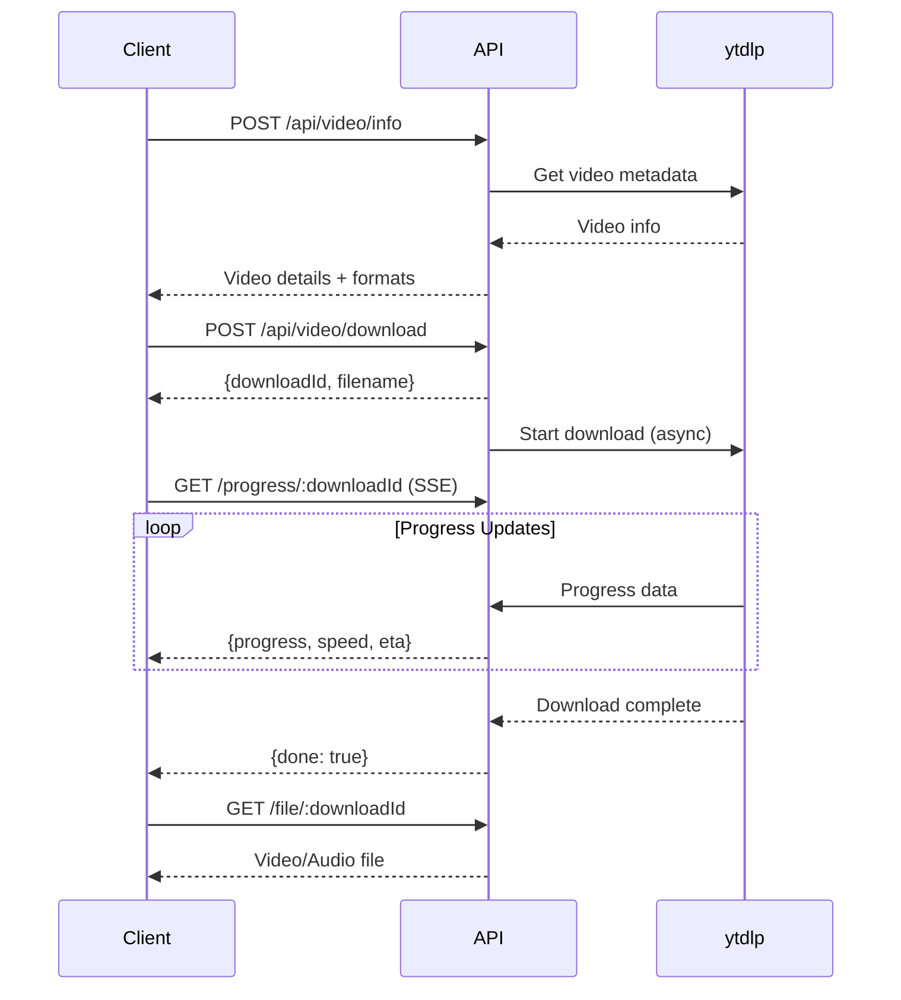

# 📡 API Documentation

**YouTube Downloader API v2.0**  
Created by [Rolan (RNR)](https://rolan-rnr.netlify.app/)

---

## Base URL

```
http://localhost:5000/api
```

---

## Authentication

Currently, no authentication is required. Rate limiting is applied to all endpoints.

---

## Rate Limiting

- **Window**: 60 seconds
- **Max Requests**: 10 per window per IP
- **Headers**: `X-RateLimit-Limit`, `X-RateLimit-Remaining`, `X-RateLimit-Reset`

---

## Endpoints

### 1. Get Video Information

Fetches metadata about a YouTube video.

**Endpoint**: `POST /api/video/info`

**Request Body**:
```json
{
  "url": "https://www.youtube.com/watch?v=VIDEO_ID"
}
```

**Response** (200 OK):
```json
{
  "success": true,
  "data": {
    "videoId": "dQw4w9WgXcQ",
    "title": "Rick Astley - Never Gonna Give You Up",
    "author": "Rick Astley",
    "lengthSeconds": "213",
    "thumbnail": "https://i.ytimg.com/vi/dQw4w9WgXcQ/maxresdefault.jpg",
    "description": "The official video for...",
    "formats": [
      {
        "itag": 137,
        "quality": "1080p",
        "container": "mp4",
        "hasVideo": true,
        "hasAudio": false,
        "qualityLabel": "1080p",
        "contentLength": "50000000"
      }
    ]
  }
}
```

**Error Response** (400 Bad Request):
```json
{
  "success": false,
  "error": "Invalid YouTube URL"
}
```

---

### 2. Start Download

Initiates a video/audio download and returns a download ID for progress tracking.

**Endpoint**: `POST /api/video/download`

**Request Body**:
```json
{
  "url": "https://www.youtube.com/watch?v=VIDEO_ID",
  "quality": "720p",
  "audioOnly": false
}
```

**Parameters**:
- `url` (string, required): YouTube video URL
- `quality` (string, optional): Desired quality (144p, 360p, 720p, 1080p, etc.). Default: 720p
- `audioOnly` (boolean, optional): If true, downloads audio only in MP3 format. Default: false

**Response** (200 OK):
```json
{
  "success": true,
  "data": {
    "downloadId": "1759404550083-hojigg",
    "filename": "Rick_Astley_Never_Gonna_Give_You_Up.mp4"
  },
  "message": "Download started"
}
```

**Notes**:
- Download happens asynchronously on the server
- Use the `downloadId` to track progress via the progress endpoint
- Once complete, retrieve the file using the file endpoint

---

### 3. Track Download Progress (Server-Sent Events)

Streams real-time progress updates for an ongoing download.

**Endpoint**: `GET /api/video/progress/:downloadId`

**Parameters**:
- `downloadId` (string, required): The download ID returned from the download endpoint

**Response**: Server-Sent Events stream

**Event Data Format**:
```json
{
  "progress": 45.2,
  "eta": "00:03",
  "speed": "2.5MiB/s"
}
```

When download is complete:
```json
{
  "progress": 100,
  "eta": "00:00",
  "speed": "Complete",
  "done": true
}
```

**Example Usage** (JavaScript):
```javascript
const eventSource = new EventSource(`/api/video/progress/${downloadId}`);

eventSource.onmessage = (event) => {
  const data = JSON.parse(event.data);
  console.log(`Progress: ${data.progress}%`);
  console.log(`Speed: ${data.speed}`);
  console.log(`ETA: ${data.eta}`);
  
  if (data.done) {
    eventSource.close();
    // Download complete, retrieve file
  }
};

eventSource.onerror = (error) => {
  console.error('Progress tracking error:', error);
  eventSource.close();
};
```

---

### 4. Retrieve Downloaded File

Downloads the completed video/audio file.

**Endpoint**: `GET /api/video/file/:downloadId`

**Parameters**:
- `downloadId` (string, required): The download ID from the download endpoint

**Response**: Binary data (video/audio file)

**Headers**:
- `Content-Type`: `video/mp4` or `audio/mpeg`
- `Content-Disposition`: `attachment; filename="filename.mp4"`
- `X-Suggested-Filename`: The sanitized filename

**Example Usage** (JavaScript/Fetch):
```javascript
const response = await fetch(`/api/video/file/${downloadId}`);
const blob = await response.blob();

// Create download link
const url = window.URL.createObjectURL(blob);
const link = document.createElement('a');
link.href = url;
link.download = filename;
link.click();
window.URL.revokeObjectURL(url);
```

**Error Response** (404 Not Found):
```json
{
  "success": false,
  "error": "Download not found or expired"
}
```

---

### 5. Get Quality Options

Retrieves available quality options for a video.

**Endpoint**: `POST /api/video/qualities`

**Request Body**:
```json
{
  "url": "https://www.youtube.com/watch?v=VIDEO_ID"
}
```

**Response** (200 OK):
```json
{
  "success": true,
  "data": {
    "videoQualities": ["2160p", "1440p", "1080p", "720p", "480p", "360p", "240p", "144p"],
    "audioQualities": ["AUDIO_QUALITY_HIGH", "AUDIO_QUALITY_MEDIUM"]
  }
}
```

---

### 6. Validate URL

Checks if a YouTube URL is valid and the video is available.

**Endpoint**: `POST /api/video/validate`

**Request Body**:
```json
{
  "url": "https://www.youtube.com/watch?v=VIDEO_ID"
}
```

**Response** (200 OK):
```json
{
  "success": true,
  "valid": true
}
```

---

### 7. Health Check

Checks if the API is running.

**Endpoint**: `GET /health`

**Response** (200 OK):
```json
{
  "status": "ok",
  "timestamp": "2025-01-02T12:00:00.000Z"
}
```

---

### 8. Test yt-dlp Installation

Tests if yt-dlp is properly installed and working.

**Endpoint**: `GET /api/video/test`

**Response** (200 OK):
```json
{
  "success": true,
  "message": "yt-dlp is working",
  "version": "2024.08.06"
}
```

---

## Download Flow

### Complete Download Process:



### Step-by-Step:

1. **Get Video Info**
   ```javascript
   const info = await fetch('/api/video/info', {
     method: 'POST',
     headers: { 'Content-Type': 'application/json' },
     body: JSON.stringify({ url: 'youtube-url' })
   }).then(r => r.json());
   ```

2. **Start Download**
   ```javascript
   const download = await fetch('/api/video/download', {
     method: 'POST',
     headers: { 'Content-Type': 'application/json' },
     body: JSON.stringify({ 
       url: 'youtube-url',
       quality: '720p',
       audioOnly: false 
     })
   }).then(r => r.json());
   
   const { downloadId, filename } = download.data;
   ```

3. **Track Progress**
   ```javascript
   const eventSource = new EventSource(`/api/video/progress/${downloadId}`);
   
   eventSource.onmessage = (event) => {
     const { progress, speed, eta, done } = JSON.parse(event.data);
     updateProgressBar(progress);
     if (done) eventSource.close();
   };
   ```

4. **Retrieve File**
   ```javascript
   const response = await fetch(`/api/video/file/${downloadId}`);
   const blob = await response.blob();
   downloadBlob(blob, filename);
   ```

---

## Error Handling

### Common Error Codes:

| Code | Meaning | Common Causes |
|------|---------|---------------|
| 400 | Bad Request | Invalid URL, missing parameters |
| 404 | Not Found | Download expired or invalid downloadId |
| 429 | Too Many Requests | Rate limit exceeded |
| 500 | Internal Server Error | yt-dlp error, network issues |

### Error Response Format:
```json
{
  "success": false,
  "error": "Human-readable error message"
}
```

---

## Best Practices

1. **Always validate URLs** before starting downloads
2. **Use progress tracking** for better UX
3. **Handle errors gracefully** with user-friendly messages
4. **Clean up resources** by closing EventSource connections
5. **Respect rate limits** to avoid getting blocked
6. **Cache video info** to reduce API calls

---

## Rate Limit Headers

Every response includes rate limit information:

```
X-RateLimit-Limit: 10
X-RateLimit-Remaining: 7
X-RateLimit-Reset: 1609459200
```

---

## Notes

- Downloads are temporary and expire after 5 seconds once complete
- Maximum file size is limited by server configuration
- Supported formats: MP4 (video), MP3 (audio)
- yt-dlp must be installed on the server
- FFmpeg required for audio conversion

---

**Created by [Rolan (RNR)](https://rolan-rnr.netlify.app/)**
